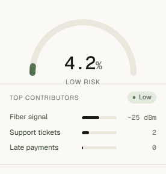

# NetIntel


> **Live demo:** https://netintel-amd.vercel.app/ · **Code:** https://github.com/iam-amd/netintel


NetIntel is a small ISP customer-retention tool. It helps an operator find
customers who may need attention before they disconnect or move to another
provider.

The idea is simple: an ISP already sees warning signs every day. Complaints,
late payments, outages, weak fiber signal, and no recent contact all tell a
story. NetIntel turns those signals into a clear risk score and a next action.

> This public project uses synthetic data only. It does not contain real Rico
> Net customer names, phone numbers, addresses, MAC addresses, billing data, or
> OLT records.

## Why This Is Useful

Small ISPs usually work reactively:

- customer complains
- technician checks the issue
- payment reminder is sent late
- customer leaves before anyone notices the pattern

NetIntel shows how a simple decision-support system can help the team act
earlier:

- call high-risk customers
- check weak-signal customers
- follow up on late payments
- prioritize support work
- review customer lists instead of guessing

## Live risk scoring



Drag any slider — fiber strength, late payments, outages, tenure, support load — and the risk gauge, top contributors, and suggested next step update in real time. The model is scored entirely in the browser. No requests, no backend, no customer data leaves the page.

## What The App Does

- Search simulated customers by name, username, customer ID, phone, or locality
- Click a customer and generate a clear risk report
- Adjust the selected customer with simple sliders
- Explain the top reasons behind the score
- Suggest a practical operator action
- Upload a CSV and score many customers at once
- Show average risk, high-risk count, risk by plan, and a priority list
- Light and dark theme, with the choice remembered between visits
- Run fully on Vercel as a static React app

## How It Works

1. `generate_dataset.py` creates realistic synthetic ISP customer records.
2. `train_model.py` trains a Logistic Regression model in Python.
3. The model is exported to `model/model_artifact.json`.
4. The React app reads that JSON and calculates churn risk in the browser.

No Python server is needed after deployment.

## Demo Dataset

The included `data/customers.csv` contains 2,500 simulated subscribers. The
names, usernames, phone numbers, and localities are generated only for demo
usage. They are made to look like an ISP customer list so the dashboard can be
searched and tested like a real workflow.

Example identity fields:

```text
customer_id: DEMO-CUST-00024
username: arun.kumar1023
first_name: Arun
last_name: Kumar
phone: 9000000024
locality: Orikkai
```

When you click a customer in the app, NetIntel combines their profile,
complaints, payment behavior, outage history, and fiber signal into a small
operator report.

## Tech Stack

- Python
- Pandas
- NumPy
- scikit-learn
- React
- TypeScript
- Vite
- Vercel

## Project Structure

```text
netintel/
|-- data/
|   `-- customers.csv
|-- model/
|   |-- model_artifact.json
|   `-- model_metrics.json
|-- src/
|   |-- App.tsx
|   |-- csv.ts
|   |-- modelScorer.ts
|   `-- styles.css
|-- generate_dataset.py
|-- train_model.py
|-- MODEL_CARD.md
|-- package.json
|-- requirements.txt
|-- vite.config.ts
`-- README.md
```

## Run Locally

Install frontend dependencies:

```bash
npm install
```

Generate data and train the model:

```bash
pip install -r requirements.txt
python generate_dataset.py
python train_model.py
```

Start the app:

```bash
npm run dev
```

Build for production:

```bash
npm run build
```

## CSV Upload Format

Use `data/customers.csv` as the sample file.

Required columns:

```text
customer_id
username
first_name
last_name
phone
locality
plan_type
area_type
region
monthly_revenue_inr
tenure_months
data_usage_gb
support_tickets_30d
late_payments_6m
payment_delay_days
days_since_last_contact
outages_30d
avg_rx_power_dbm
plan_change_count
has_fiber
auto_pay
referrals_brought
```

Example row:

```csv
customer_id,username,first_name,last_name,phone,locality,plan_type,area_type,region,monthly_revenue_inr,tenure_months,data_usage_gb,support_tickets_30d,late_payments_6m,payment_delay_days,days_since_last_contact,outages_30d,avg_rx_power_dbm,plan_change_count,has_fiber,auto_pay,referrals_brought
DEMO-CUST-00001,arun.kumar1000,Arun,Kumar,9000000001,Orikkai,Standard_100Mbps,Residential,South,799,18,210,1,0,0,35,0,-20.4,1,1,1,2
```

Field meaning:

| Column | Meaning |
|---|---|
| `username`, `first_name`, `last_name`, `phone`, `locality` | Demo identity fields used for searching and report display |
| `support_tickets_30d` | Complaints or tickets in the last 30 days |
| `late_payments_6m` | Number of delayed payments in the last 6 months |
| `payment_delay_days` | Average delay after due date |
| `days_since_last_contact` | Days since the ISP last contacted the customer |
| `outages_30d` | Service interruptions in the last 30 days |
| `avg_rx_power_dbm` | Average fiber signal level; below `-27 dBm` is weak |
| `auto_pay` | `1` if enabled, `0` if not |
| `has_fiber` | `1` for fiber connection, `0` otherwise |

## Model Notes

The model is Logistic Regression. I chose it because it is easy to explain,
small enough to export as JSON, and suitable for a clear student project.

Current generated-data metrics:

```text
Precision: 0.492
Recall:    0.836
F1:        0.620
ROC-AUC:   0.894
```

This is not a claim of real production accuracy. The metrics only describe the
synthetic dataset in this repo.

## Deploy To Vercel

1. Push this repository to GitHub.
2. Import it in Vercel.
3. Use:

```text
Framework Preset: Vite
Build Command: npm run build
Output Directory: dist
```

## What I Learned

- A useful ML project does not need to be complicated.
- A simple model is easier to explain in interviews.
- UI matters: operators need clear actions, not just a probability.
- Deployment matters: exporting the model to JSON makes the app easy to host.
- Synthetic data is useful for public demos when real customer data must stay private.

## Limitations

- The dataset is synthetic.
- The app is decision-support, not an automated decision system.
- A real version would need anonymized production data, privacy review, and retraining.

## Author

Bagrudeen Ali Ahamed

Built as a public-safe ML demo inspired by real ISP operations and the Rico Net
management platform.
